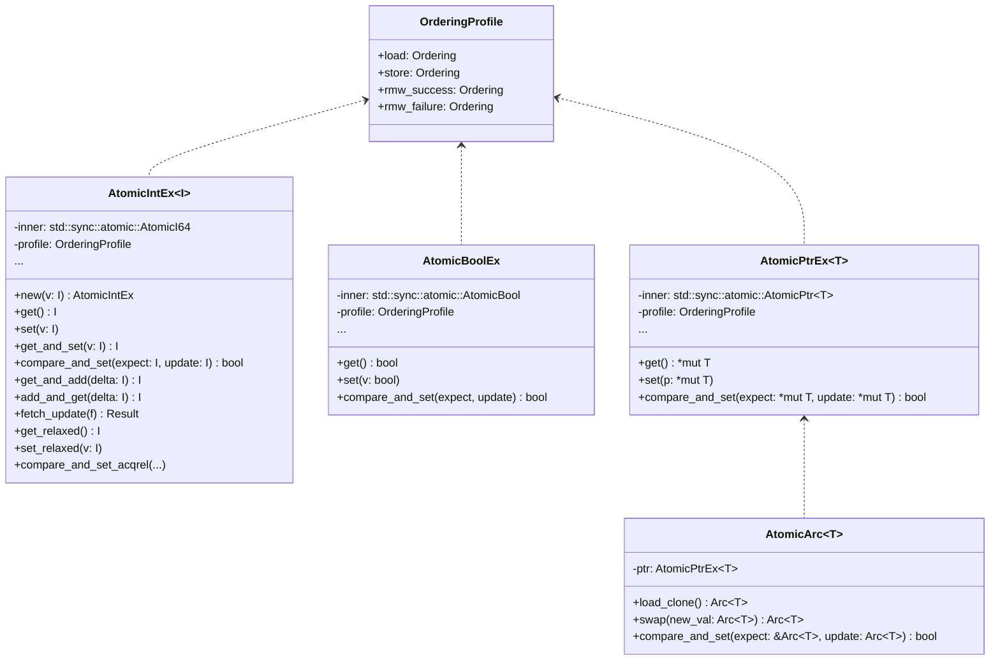

# Rust 原子类型易用性封装设计（v1.0）

- 版本：v1.0
- 作者：胡海星
- 适用范围：为 `std::sync::atomic` 下的原子类型提供易用、可读、可维护的 API 封装，参考 JDK `java.util.concurrent.atomic` 的风格与默认语义。

## 1. 背景与问题

Rust 标准库原子类型（如 `AtomicUsize`、`AtomicBool`、`AtomicPtr` 等）在正确性与性能上非常强大，但直接使用时存在几个易用性痛点：
- 每次 `load`/`store`/`fetch_*`/`compare_exchange*` 都需要显式传入 `Ordering`，对非专家用户不友好。
- `compare_exchange` 成功/失败的不同内存序要求理解门槛高；弱/强 CAS 方法命名不直观。
- 常见的 JDK 风格操作（如 `getAndSet`、`getAndAdd`、`compareAndSet` 的布尔返回、返回“旧值/新值”的对称 API）在命名和返回值体验上不统一。
- 对“引用类”的原子封装不直观：`AtomicPtr<T>` 的裸指针生命周期与释放语义需要额外的内存安全策略。

因此，目标是在不牺牲性能的前提下，通过封装提供：
- 安全的默认内存序（“开箱即用”）
- 明确、简洁的 JDK 风格 API
- 显式但不繁琐的“弱化内存序”选项（在需要时才选择）
- 对指针/引用类的安全封装（`Arc`/`Box` 等）

## 2. 设计目标

- 易用性：常用方法不要求每次显式传 `Ordering`；默认保证正确性。
- 可读性：JDK 风格命名（`get`/`set`/`get_and_*`/`compare_and_set` 等），统一返回值契约。
- 安全默认：默认使用严格但常见的顺序（`SeqCst` 或“读 Acquire、写 Release、RMW AcqRel”），避免隐性内存模型坑。
- 显式弱化：提供有后缀的方法族（如 `*_relaxed`、`*_acqrel`、`*_acquire`、`*_release`）以在热点性能路径上主动选择更弱的顺序。
- 零额外开销：封装为 `#[repr(transparent)]` 的新类型或薄封装，不引入额外内存或分配。
- 可扩展：支持整数类、布尔、指针，以及对 `Arc<T>`/`Box<T>` 的安全变体。

## 3. 总体方案

### 3.1 模块划分

- `atomic/ordering_profile.rs`：默认内存序配置与类型化方案（见 4 章）
- `atomic/int.rs`：`AtomicI{8,16,32,64,128}`、`AtomicU{8,16,32,64,128}`、`AtomicIsize`、`AtomicUsize` 封装
- `atomic/bool.rs`：`AtomicBoolEx`
- `atomic/ptr.rs`：`AtomicPtrEx<T>`
- `atomic/arc.rs`：`AtomicArc<T>`（基于 `AtomicPtr` 的安全封装）
- `atomic/box.rs`：`AtomicBox<T>`（谨慎提供，限制使用场景）
- `atomic/fence.rs`：围栏便捷方法（可选）
- `atomic/prelude.rs`：常用导出

命名约定：在不与标准库类型冲突的情况下，使用 `Ex` 后缀或新的类型名，避免与 `std::sync::atomic` 同名造成歧义。

### 3.2 类型关系（类图）



备注：`AtomicIntEx<I>` 实际会通过宏为不同位宽类型生成具体实现，图中以 `i64` 示意。

## 4. 内存序策略

### 4.1 默认策略（开箱即用）

- `get()`：`load(Ordering::SeqCst)`
- `set(v)`：`store(v, Ordering::SeqCst)`
- RMW（如 `get_and_add`、`get_and_set`）：成功 `SeqCst`
- CAS（`compare_and_set`）：成功 `SeqCst`，失败 `SeqCst`（简单安全）

此策略与 JDK 的“volatile 语义”在直觉上接近（全序对所有原子操作），让用户无需首先理解 Acquire/Release 细节即可写出正确代码。

### 4.2 性能友好策略（可配置）

提供 `OrderingProfile` 作为构造时的可选参数，或通过构造器后缀选择不同预设：

- `OrderingProfile::seqcst()`：如 4.1 默认
- `OrderingProfile::acqrel_global()`：
  - `load`: `Acquire`
  - `store`: `Release`
  - RMW/CAS 成功：`AcqRel`
  - 失败：`Acquire`（CAS 失败不应发布写）
- `OrderingProfile::relaxed_all()`：
  - 所有操作 `Relaxed`（仅适合某些统计型计数器等）

构造方式示例：
```rust
let a = AtomicU64Ex::with_profile(0, OrderingProfile::acqrel_global());
let b = AtomicU64Ex::new(0); // 等价于 seqcst
```

同时提供显式后缀方法族，用于热点路径微调：
- `get_relaxed()` / `set_relaxed(...)`
- `get_acquire()` / `set_release(...)`
- `get_and_add_acqrel(...)` 等

### 4.3 方法与内存序映射表

- 读取类
  - `get()` → `load(profile.load)`
- 写入类
  - `set(v)` → `store(v, profile.store)`
- RMW 类（`get_and_*` / `*_and_get`）
  - 成功 → `profile.rmw_success`
- CAS 类
  - 成功 → `profile.rmw_success`
  - 失败 → `profile.rmw_failure`

默认 `seqcst()` 时，这四个字段都为 `SeqCst`；`acqrel_global()` 时分别是 `Acquire/Release/AcqRel/Acquire`。

## 5. API 设计

### 5.1 整数与布尔

- 统一方法族（示例以 `AtomicU64Ex`）：
  - 读取/写入：
    - `get() -> u64`
    - `set(v: u64)`
    - 变体：`get_relaxed()`、`set_release(v)` 等
  - 交换：
    - `get_and_set(v: u64) -> u64`
  - 算术：
    - `get_and_add(delta) -> u64`
    - `add_and_get(delta) -> u64`（内部使用 `get_and_add` 实现）
    - 类似提供 `sub`、`and`、`or`、`xor`
  - CAS：
    - `compare_and_set(expect, update) -> bool`（强 CAS，失败返回 `false`）
    - `weak_compare_and_set(expect, update) -> bool`（弱 CAS，可能伪失败）
  - 更新：
    - `fetch_update(f: Fn(u64) -> Option<u64>) -> Result<u64, u64>`
      - 与 `Atomic*::fetch_update` 契约一致：`Ok(old)` on success, `Err(last_seen)` on failure

- 布尔与整数 API 对齐（移除歧义）。

- 溢出语义：
  - 算术操作使用与 `std` 一致的“环绕”语义（`wrapping_*`），文档显式说明。

### 5.2 指针与引用

- `AtomicPtrEx<T>`：
  - 仅封装指针的原子语义；不涉及所有权管理
  - 常用方法：`get()`、`set()`、`get_and_set()`、`compare_and_set()`
  - 明确文档：释放责任在外部；对齐 `AtomicPtr` 的安全约束

- `AtomicArc<T>`（首推引用封装）：
  - 内部存储为裸指针，外部 API 使用 `Arc<T>`
  - `load_clone() -> Arc<T>`：原子读取并 `Arc::increment_strong_count`，返回拥有所有权的克隆
  - `swap(new: Arc<T>) -> Arc<T>`：返回旧的 `Arc<T>`
  - `compare_and_set(expect: &Arc<T>, update: Arc<T>) -> bool`：基于指针比较
  - 掉引用（`Arc::from_raw`/`Arc::into_raw`）时注意异常安全与 ABA 风险
  - 文档强调：不保证对 `T` 的内部变更同步（需要用户额外同步策略）

- `AtomicBox<T>`（可选）：
  - 对可独占拥有的指针做交换/读取（会发生 move）
  - 仅在明确需要“可替换的唯一拥有者”时使用，默认不推荐
  - 与 `AtomicArc<T>` 相比，`AtomicBox<T>` 需要明确释放旧对象，文档需要强调泄漏/双重释放风险防护

### 5.3 错误与返回值规范

- CAS 风格统一返回 `bool`（JDK 风格），同时提供返回旧值/新值的变体：
  - `compare_exchange(expect, update) -> Result<old, old>`（与 `std` 一致，定位细致用）
  - `compare_and_set(expect, update) -> bool`（直觉友好）
- 不对失败情况抛错；使用 `Result` 或 `bool`，拒绝 `panic`。
- 对外暴露的错误类型（若有）使用 `thiserror`，但本设计首选无错误类型 API。

## 6. 可用性示例

```rust
use crate::atomic::{AtomicU64Ex, OrderingProfile};

fn example_seqcst_counter() {
    let counter = AtomicU64Ex::new(0);
    counter.add_and_get(1);
    assert_eq!(counter.get(), 1);
    let old = counter.get_and_add(9);
    assert_eq!(old, 1);
    assert_eq!(counter.get(), 10);
}

fn example_acqrel_counter() {
    let counter = AtomicU64Ex::with_profile(0, OrderingProfile::acqrel_global());
    let old = counter.get_and_add(1);
    assert_eq!(old + 1, counter.get());
}

fn example_cas() {
    let v = AtomicU64Ex::new(100);
    assert!(v.compare_and_set(100, 200));
    assert!(!v.compare_and_set(100, 300));
    assert_eq!(v.get(), 200);
}
```

`AtomicArc<T>`：

```rust
use std::sync::Arc;
use crate::atomic::AtomicArc;

#[derive(Debug)]
struct Config { version: u64 }

fn example_atomic_arc() {
    let a = AtomicArc::new(Arc::new(Config { version: 1 }));

    // 读取当前值的 Arc 拷贝
    let current = a.load_clone();
    assert_eq!(current.version, 1);

    // 原子替换
    let old = a.swap(Arc::new(Config { version: 2 }));
    assert_eq!(old.version, 1);

    // CAS
    let expect = a.load_clone();
    let ok = a.compare_and_set(&expect, Arc::new(Config { version: 3 }));
    assert!(ok);
}
```

## 7. 性能与内存模型说明

- 默认 `SeqCst`：最直观且避免绝大多数因内存模型误解导致的 bug；在弱序平台代价可能更高，但对大多数业务足够。
- 推荐性能配置 `acqrel_global()`：对只需“读 Acquire/写 Release/RMW AcqRel”的经典生产者—消费者等场景性能更好。
- 热点优化：通过显式后缀方法选择 `Relaxed`/`Acquire`/`Release`/`AcqRel`。
- 保持与 `std` 一致的语义：封装仅决定默认 `Ordering`，不改变底层操作的语义或屏障插入位置。

## 8. 实现细节

### 8.1 封装结构

- `#[repr(transparent)]` 包裹底层 `Atomic*`，附带一个 `OrderingProfile` 字段（可 `Copy`）。
- 常量预设 `const PROFILE_SEQCST: OrderingProfile` 等，避免额外开销。
- 方法内联 `#[inline]`，保证零成本抽象（编译器可完全优化）。

### 8.2 宏生成

- 采用宏为整数族生成相同 API，避免重复代码：
  - `impl_atomic_int!(AtomicU64Ex, std::sync::atomic::AtomicU64, u64);`
- 布尔与指针单独实现，保证可读性。

### 8.3 `AtomicArc<T>` 细节

- 内部存 `AtomicPtr<T>`，对外 API 暴露 `Arc<T>`。
- `load_clone()`：
  - `ptr = inner.load(profile.load);`
  - `if !ptr.is_null() { unsafe { Arc::increment_strong_count(ptr); Arc::from_raw(ptr) } } else { panic/或返回默认?（建议禁止空指针态） }`
- `swap(new: Arc<T>)`：
  - `let new_ptr = Arc::into_raw(new) as *mut T;`
  - `let old_ptr = inner.swap(new_ptr, profile.rmw_success);`
  - `unsafe { Arc::from_raw(old_ptr) }`
- `compare_and_set(expect: &Arc<T>, update: Arc<T>)`：
  - 基于 `Arc::as_ptr` 指针相等做 CAS，成功后消费 `update`，失败时 `update` 需要转回 `Arc::from_raw` 防止泄漏（或先不 `into_raw`，成功后再 `into_raw`）。
- 文档明确 ABA 风险不由该类型消除，如需避免需外部增加版本标记等机制。

### 8.4 `no_std` 与依赖

- 初版面向 `std` 环境；不引入第三方依赖。
- 后续可选：与 `crossbeam` 的 `AtomicCell` 对比与互补（`AtomicCell` 强调按位可复制类型，语义略有不同）。

## 9. 对标 JDK API 的映射

- `get` ↔ `load`
- `set` ↔ `store`
- `compareAndSet` ↔ `compare_exchange`（对外统一为布尔返回）
- `getAndSet` ↔ `swap`/`fetch_*`
- `getAndAdd`/`addAndGet` ↔ `fetch_add`
- `weakCompareAndSet` ↔ `compare_exchange_weak`

与 JDK 不同：
- Rust 允许细粒度选择 `Ordering`；我们以“配置 + 后缀方法”方式承载高级需求。

## 10. 风险与边界

- 过度依赖 `Relaxed`：文档与类型签名中要显式提醒，仅在确定无需跨线程可见性时使用。
- `AtomicArc<T>` 的 ABA 问题：需业务层处理版本化或使用标签指针等手段。
- `AtomicBox<T>` 的释放时机与异常安全：默认不启用，或加 `feature` 守护并提供使用指南。

## 11. 迭代计划

- v1.0：整数/布尔/指针封装 + 预设 `OrderingProfile` + 显式后缀方法族 + `AtomicArc<T>`
- v1.1：`AtomicBox<T>`（可选）、更多便捷 CAS 循环工具（如 `update_with_retry`）
- v1.2：特性开关支持（默认 `seqcst` 或 `acqrel_global`）、文档与基准测试完善

## 12. 总结

本方案在不改变 Rust 原子语义的前提下，以“安全默认 + JDK 风格 API + 显式弱化选项”的方式，显著降低了使用门槛，并保留了性能优化空间。通过 `OrderingProfile` 与方法后缀，既避免了初学者对内存序的困扰，也给专家保留了所有优化控制权。


